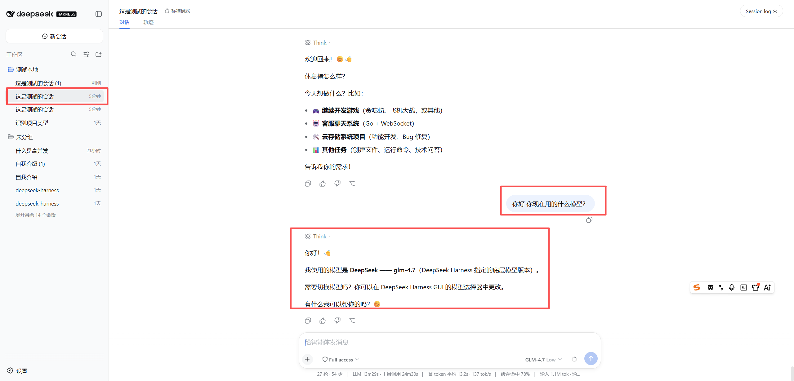
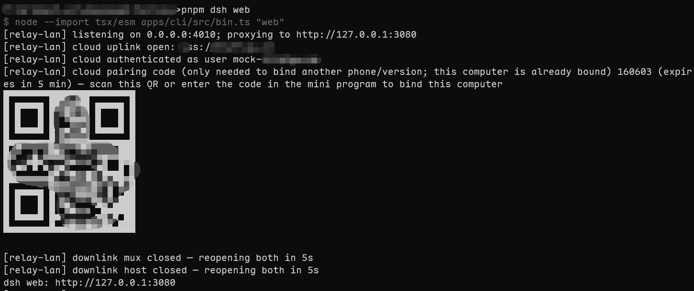

# dsh-remote

在手机上(微信小程序)远程使用 PC 上的 [deepseek-harness](https://www.deepseek.com/harness/):查看会话、继续对话、管理工作区文件夹、切换模型/推理等级/权限,支持流式输出、思考过程、工具轨迹、人工审批面板与任务清单。

**agent 始终跑在你的 PC 上**(会话、历史、模型配置都取自 PC,PC 在线才能聊);中继只做跨网络帧转发,不落任何会话数据。

```
┌──────────┐ wss/https ┌────────────┐ wss(出站) ┌──────────────────────────┐
│ 微信小程序 │ ◄───────► │   云中继    │ ◄───────── │ PC: deepseek-harness      │
│ (客户端)  │           │ (自建,可选) │            │     + dsh-relay-plugin    │
└──────────┘           └────────────┘            └──────────────────────────┘
                        手机与 PC 同局域网时,可跳过云中继直连插件 LAN 端口
```

| 目录 | 说明 |
|---|---|
| `dsh-relay-plugin/` | cordis bundle 插件,装入 deepseek-harness 的 web profile,随 `dsh web` 自动运行;LAN 监听 + 可选云上行 + 配对码/设备绑定 |
| `dsh-cloud-relay/` | 云中继服务器(Node + ws):设备上行 WS `/device`、手机 WS `/client` 帧路由、6 位码配对、绑定持久化、限流 |
| `dsh-miniprogram/` | 微信小程序(原生开发,无构建步骤) |

## 演示

| PC 启动 `dsh web`,终端打印配对码 + 二维码 | 手机小程序扫码/输码绑定 |
| :---: | :---: |
|  |  |

完整演示视频:[docs/demo/demo.mp4](docs/demo/demo.mp4)

## 快速开始

### 1. PC:安装插件

在 deepseek-harness 仓库内:

```sh
pnpm dsh plugin --profile web add link:/path/to/dsh-remote/dsh-relay-plugin
pnpm dsh web
```

启动后终端会打印 6 位配对码 + 二维码。**只走局域网(可选)**到此为止:小程序 `RELAY_BASE` 填 `http://<PC内网IP>:4010` 即可。

> 改了插件源码后需要重启 `dsh web` 才生效。

### 2. 部署云中继(需要外网访问时)

```sh
cd dsh-cloud-relay
docker build -t dsh-cloud-relay .
docker run -d --name dsh-cloud-relay --restart=always \
  -p 127.0.0.1:4020:4020 -v $(pwd)/state:/data dsh-cloud-relay
```

中继只绑 `127.0.0.1`,公网入口统一走 nginx TLS(https + wss),示例(限流部分强烈建议保留):

```nginx
# http {} 块内:
# limit_req_zone  $binary_remote_addr zone=pair:10m  rate=10r/m;
# limit_conn_zone $binary_remote_addr zone=perip:10m;

server {
  listen 443 ssl;
  server_name relay.example.com;
  ssl_certificate     /path/fullchain.pem;
  ssl_certificate_key /path/privkey.pem;

  location /pair/claim {
    limit_req zone=pair burst=5 nodelay;
    proxy_pass http://127.0.0.1:4020;
    proxy_set_header X-Forwarded-For $proxy_add_x_forwarded_for;
  }
  location / {
    limit_conn perip 20;
    proxy_pass http://127.0.0.1:4020;
    proxy_http_version 1.1;
    proxy_set_header Upgrade $http_upgrade;
    proxy_set_header Connection "upgrade";
    proxy_set_header X-Forwarded-For $proxy_add_x_forwarded_for;
    proxy_read_timeout 3600s;
  }
}
```

然后让插件连上你的中继(环境变量方式,或写入 `~/.dsh/relay-lan.json` 的 `cloudUrl`):

```sh
RELAY_CLOUD_URL=wss://relay.example.com pnpm dsh web
```

### 3. 配置小程序

1. 微信开发者工具 → 导入项目 → 选择 `dsh-miniprogram`(appid 已设为 `touristappid`,可换成你自己的测试号)。
2. **必改**:编辑 `dsh-miniprogram/utils/config.js`:

```js
module.exports = {
  RELAY_BASE: 'https://relay.example.com',  // 你的中继地址,https 起头;WS 地址自动推导为 wss
  USER_KEY: 'relayUserV2',
}
```

3. 真机/体验版需要在 [小程序后台](https://mp.weixin.qq.com) 配置合法域名:
   - request 合法域名:`https://relay.example.com`
   - socket 合法域名:`wss://relay.example.com`
   - (开发者工具里 `urlCheck: false` 只对工具模拟器和调试生效)

### 4. 配对

1. PC 上 `dsh web` 启动 → 终端打印 6 位配对码 + 二维码(5 分钟有效,过期重启 `dsh web` 出新码)。
2. 小程序:设备页 → 连接设备 → 输码或扫码 → 绑定成功。
3. 绑定持久化两端(PC `~/.dsh/relay-lan.json` 存 token,中继存 state),之后重启免配对。
4. **一台设备可绑定多个身份**:小程序的开发版/体验版/正式版/多台手机是相互独立的身份,各自扫一次码即可同时绑定;在"我的"页解绑只摘除当前身份。

## 配置参考

| 组件 | 配置 | 位置 | 默认 | 说明 |
|---|---|---|---|---|
| 小程序 | `RELAY_BASE` | `utils/config.js` | 占位符,**必改** | 中继地址;`http(s)://` 起头,WS 自动推导 |
| 小程序 | `USER_KEY` | `utils/config.js` | `relayUserV2` | 身份在 wx storage 的 key,一般不动 |
| 插件 | `RELAY_CLOUD_URL` | 环境变量 | 空(不连云) | `wss://relay.example.com`;设空串 = 强制只走 LAN |
| 插件 | `cloudUrl` / `keepPairing` | `~/.dsh/relay-lan.json` | — | 同名配置的持久化形式,优先级低于环境变量 |
| 插件 | `RELAY_LAN_PORT` | 环境变量 | `4010` | LAN 监听端口(`0.0.0.0`) |
| 插件 | `RELAY_CLOUD_PAIRING` | 环境变量 | `0` | `1` = 已绑定时也持续刷新配对码(每 4 分钟);默认只在启动时打一个码、未绑定时持续换新 |
| 中继 | `RELAY_PORT` | 环境变量 | `4020` | 监听端口 |
| 中继 | `RELAY_STATE` | 环境变量 | `~/.dsh/cloud-relay.json` | 绑定关系持久化文件 |

## 协议速览

- HTTP(直连插件或经中继转发):`/health` `/bindings` `/pair/claim` `/devices/rename` `/devices/unbind` `/sessions` `/sessions/<id>/surface`
- WS `/device`:插件上行;`auth {token}` 或 `pairing.start` → `pairing.code`
- WS `/client?user=&deviceId=&port=`:手机客户端;`t:req/t:res`(RPC 帧)与 `t:ev`(事件流下发,桥接 harness 的 `events.mux`/`events.host`)
- agent RPC 信封:`POST /api/<method>`,体 `{"type":"client-request","rpcId":"<uuid>","method":"<method>","payload":{...}}`

## 安全须知

- **公网必须 TLS**:中继本身无加密,只绑 `127.0.0.1` 并由 nginx 终结 TLS。
- **身份是客户端自报的**(`x-mock-user` 头,随机 userId):信任根是配对码与设备 token。任何人拿到你的 userId 理论上可冒充你连接中继。生产部署建议自行加固:小程序侧接 `wx.login` + code2session 换真会话身份,或在中继/反代层加鉴权。
- 配对码:CSPRNG 6 位数字、5 分钟过期、每码最多 3 次尝试、每 IP 20 次失败/10 分钟封禁;设备 token 为 `randomBytes(32)`。
- 限流(nginx `limit_req`/`limit_conn`)建议按上面的示例配置,防止配对码爆破与连接滥用。

## 开发

```sh
# 云中继本地实例
cd dsh-cloud-relay && RELAY_PORT=4020 RELAY_STATE=/tmp/cloud-test.json node src/server.mjs

# 多身份绑定回归测试(先起本地中继)
node test-multiuser.mjs
```

已知边界:agent 与会话数据都在 PC,PC 离线即不可用;历史消息的 TTFT/tok-s 指标因事件流快照压缩不可得,仅实时会话有完整指标。

## License

MIT
